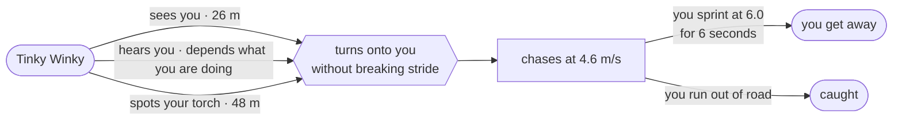

# Slendytubbies · three.js

> ### ▶ **Play now → <https://slendytubbies.pages.dev>**
> No install, no download. It runs in the browser, on a desktop, a phone or a headset.

**Ten dishes of custard are scattered across a fogged wasteland. Tinky Winky is looking for
you. Bring them all back.**

Play alone, or with up to three friends.

> [!NOTE]
> A non-commercial fan project. *Slendytubbies* is ZeoWorks'; *Teletubbies* is WildBrain's.

---

## Controls

Pick up a pad mid-game, put it down, carry on with the mouse. Nothing to switch.

| | Move | Look | Sprint | Jump | Torch | Menu |
|---|---|---|---|---|---|---|
| **Keyboard** | `WASD` / arrows | mouse | `Shift` | `Space` | `F` | `Esc` |
| **Xbox** | L stick / d-pad | R stick | L3 · RT · LB | `A` | `X` | `Start` |
| **PlayStation** | L stick / d-pad | R stick | L3 · R2 · L1 | `✕` | `□` | `Options` |
| **Switch Pro** | L stick / d-pad | R stick | L3 · ZR · L | `B` | `Y` | `+` |
| **Phone** | left-thumb stick | drag anywhere else | push the stick to its edge | ↑ button | torch button | pause button |
| **Quest / WebXR** | L thumbstick | head + R snap turn | L grip | `A` / `X` | `B` / `Y` | — |

Menus work entirely from a controller — sticks or d-pad to move, `A` to pick, `B` to go
back, bumpers to change tabs. Sliders take ← and → directly. Tapping a text box brings up an
on-screen keyboard, so you can join a friend's lobby without reaching for a keyboard.

---

## How you get caught

Tinky Winky never cheats. There are three ways it finds you, and only three.



**How loud you are, in metres:**

| | |
|---|--:|
| standing still | 1.4 |
| walking | 9 |
| pushing off a jump | 14 |
| sprinting | 21.6 |
| taking a dish | 26 |
| landing a jump | 34 |
| **going over** | **40** |

> [!IMPORTANT]
> **Your torch is the loudest thing you own.** It shows a beam from **48 m away** — nearly
> twice as far as Tinky Winky can make out your shape in the dark. It has to be roughly
> facing you, and a tree in the way will hide it. The one thing that helps you find dishes
> is the one thing that announces where you are.

Most loud things get it *walking your way*. Two things get it **turning onto you
mid-stride** — going over, and a torch it found from further off than it could have seen
you by shape. It does not stop and stare for either; it corrects its course and keeps
walking, so the very next step is already coming at you.

It does not patrol at one speed either. It picks a prowl, an amble or a brisk jog and keeps
it for a few seconds. Catching sight of one *jogging* across a clearing is a much worse
moment than watching one glide.

---

## Staying alive

**Jumping gives you stamina back** — about a tenth of the bar per hop. You can bunny-hop
across the whole map and never run out of sprint. Everything on the map will know exactly
where you are the entire time. That is the trade.

The push-off is quiet. It is **coming down** that carries — louder than sprinting, louder
than taking a dish. So you get the stamina at the top of the hop and pay for it on the way
down, a few metres further on, and a chain of hops leaves a trail of thuds behind where you
actually are.

> [!WARNING]
> **Sometimes you go over.** About one hop in thirty just does not happen — a crouch, a
> stumble, and five off the bar instead of ten back. And **sprinting over a fallen branch**
> trips you one time in ten, so the deadwood on the floor is worth reading rather than
> running through. Walking over one is always safe.
>
> Going over is **the loudest thing in the game**, louder than landing a jump — and the
> only sound that makes anything hunting you turn *onto* you rather than merely come
> looking. It is also the only one you did not choose.

**Walk over a dish to pick it up.** No button, no holding anything down. It is loud, and
every tubby hunting you turns and *bolts* — far faster than you can run, out into the open,
away from everybody at once. A few seconds later it settles and starts looking again. Every
pickup is a spike of danger and then a breather you get to watch happen.

**You are faster than it.** Sprinting is 6.0 m/s against its 4.6, so you can outrun it for
exactly as long as your six seconds of stamina last, and not a step further. A second tubby
joins the hunt once you are halfway.

Torch off, you are hard to see and nearly silent. Torch on, you can find things. That is the
whole game.

---

## Playing together

Up to four. **The host is the Guardian** — the one in the hat, carrying the big searchlight.
Everyone else is Laa-Laa, Po or Dipsy. Tinky Winky hunts all of you.

| | Public lobby | Private lobby |
|---|---|---|
| has a | **name** | **password** |
| shows in the list | yes, with the host and how many are in | **no** |
| joining | one click | type the word |

A private lobby is not just unlisted — without the password nobody can find it at all. That
same password decides which wasteland you get, so everyone walks an identical map.

Everyone is equally catchable. Your team-mates' torches light the world for you, you can see
where they are looking, whether they are walking or sprinting, and the mark left where
somebody died.

> [!TIP]
> **Caught in a lobby, you are not out.** You drop into spectating on whoever is still alive
> — press jump to cycle between them. The round only ends when everybody is down.

Win or lose, it ends for the whole party at once. Then the host gets **Play again**, which
puts everyone straight into a fresh map without leaving the lobby — same friends, same
password, new wasteland.

---

## The wasteland

A rolling forest of four hundred spruce, deadwood, boulders and a great deal of grass, grown
fresh from your lobby's password. The old trees are the big ones, with stout grey furrowed
trunks; the young ones are thin red-brown whips.

The clock runs at an hour a minute, so a full day passes in twenty-four — and the round
always begins somewhere between dusk and two in the morning. Cloud drifts and changes shape
as the night goes on. It rains sometimes.

Mist pools in the hollows rather than hanging evenly, with banks standing waist to head high
in the low ground that you walk into and out of. The air has dust and insects in it — you
will not notice most of it until you put a torch beam through it. Leave that beam burning
after dark and things start gathering in it.

---

## On a phone

The whole game runs on a phone, portrait or landscape. Left thumb moves, push the stick to
its edge to sprint, drag anywhere else to look. Jump, torch and pause sit up the right-hand
side under your other thumb.

Take a call or switch apps and the game pauses itself, so you will not come back to a
monster standing over you.

---

<details>
<summary><b>Running it yourself</b></summary>

```bash
npm run serve      # → http://localhost:8322
```

Multiplayer lobbies need the Cloudflare Worker in [`worker/`](worker/):

```bash
cd worker && npx wrangler dev --port 8787 --local
```

then point the game at it from the browser console and reload:

```js
localStorage.setItem("slendytubbies.server", "http://127.0.0.1:8787")
```

`npm run deploy` builds `dist/` and publishes it. All gameplay tuning — speeds, hearing
radii, sight range, counts — lives in [`src/game/config.js`](src/game/config.js).

</details>

---

## Credits

Non-commercial fan project. *Slendytubbies* is ZeoWorks'; *Teletubbies* is WildBrain's.
Model attributions are in [`CREDITS.md`](CREDITS.md).
