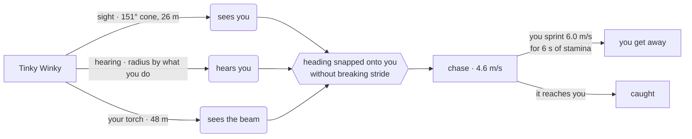
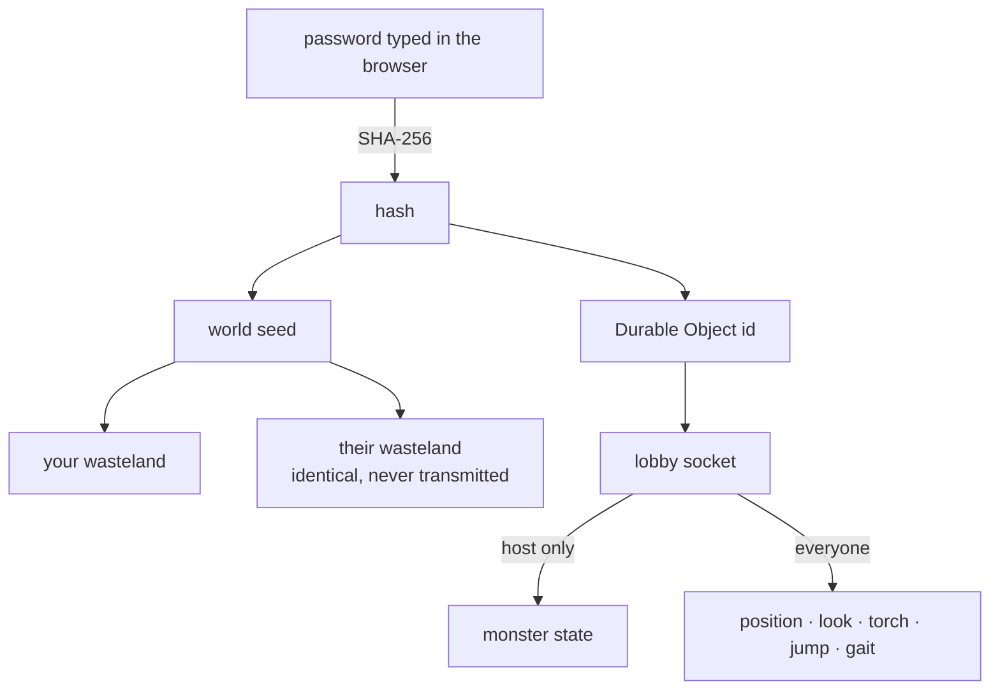

# Slendytubbies · three.js

> **▶ Play → <https://slendytubbies.pages.dev>**

A first-person survival-horror prototype. Recover ten dishes of tubby custard from a fogged
wasteland while Tinky Winky hunts you by sight and sound — alone, or with up to three friends.

```bash
npm run serve      # → http://localhost:8322
```

> [!NOTE]
> Non-commercial fan project. *Slendytubbies* is ZeoWorks'; *Teletubbies* is WildBrain's.

<details>
<summary><b>Contents</b></summary>

[Controls](#controls) · [How it plays](#how-it-plays) · [Multiplayer](#multiplayer) ·
[The wasteland](#the-wasteland) · [Light](#light) · [Sound](#sound) ·
[Phones](#phones) · [Benches](#benches) · [Layout](#layout) ·
[What things cost](#what-things-cost) · [Debug](#debug) · [Build and deploy](#build-and-deploy) ·
[Models](#models)

</details>

---

## Controls

Every input path feeds one intent struct (`src/engine/intent.js`), so devices mix freely —
pick up a pad mid-game, put it down, carry on with the mouse. No mode switch.

| | Move | Look | Sprint | Jump | Torch | Menu |
|---|---|---|---|---|---|---|
| **Keyboard** | `WASD` / arrows | mouse | `Shift` | `Space` | `F` | `Esc` |
| **Xbox** | L stick / d-pad | R stick | L3 · RT · LB | `A` | `X` | `Start` |
| **PlayStation** | L stick / d-pad | R stick | L3 · R2 · L1 | `✕` | `□` | `Options` |
| **Switch Pro** | L stick / d-pad | R stick | L3 · ZR · L | `B` | `Y` | `+` |
| **Touch** | left-thumb stick | drag anywhere else | push stick to its edge | ↑ button | torch button | pause button |
| **Quest / WebXR** | L thumbstick | head + R snap turn | L grip | `A` / `X` | `B` / `Y` | — |

Menus are fully controller-driven: either stick or the d-pad moves the cursor, `A` selects,
`B` goes back, bumpers switch tabs, `Start` resumes. Sliders take left/right directly rather
than making you "enter" them first.

<details>
<summary>Why side-by-side things take <b>left/right</b>, and text fields open a keyboard</summary>

Anything laid out side by side — the Public/Private tabs, the VR turning row — is **one stop,
walked with ← and →**. Up and down step past the whole row. Asking a player to press *down*
to get from Public to Private is asking them to walk vertically along something that is
plainly horizontal, and the arrow that matches what you can see is the one that should work.

Text fields open an **on-screen keyboard** (`src/game/osk.js`) on a pad press, a click or a
tap. Every screen was pad-navigable except the two that matter most for playing with anybody
else: a lobby needs a name and a private lobby needs a password, and neither can be typed
with a stick — a controller player could reach the Public list and nothing else. It is its
own grid rather than a reuse of the menu cursor, because on a keyboard all four directions
mean position and the menu's list walk has no way to say that.

Button *indices* are identical across all three pad families under the W3C standard mapping;
only the printed labels differ, and Nintendo transposes A/B and X/Y physically.
`detectBrand()` picks the right glyphs so nobody is told to press the wrong button.

</details>

---

## How it plays

The tubby never cheats. It finds you three ways and only three ways.



| How loud you are | Radius |
|---|--:|
| standing still | 1.4 m |
| walking | 9 m |
| sprinting | 21.6 m |
| landing a jump | 14 m |
| taking a dish | 26 m |
| **jumping** | **34 m** |

> [!IMPORTANT]
> **Your torch is the loudest thing you own.** A beam pointed at it carries **48 m** — nearly
> twice as far as it can make out a shape. It has to be facing your way (within 26° of your
> view) and nothing can be stood in between, which in a forest of 420 trunks is what keeps
> this from firing constantly. The one thing that lets you find dishes is the one thing that
> announces you from across the map.

Anything loud enough — a jump, or a torch found from beyond its sight — makes it **swing
round onto you without breaking stride**. Its heading is set outright, so the very next step
is already in the right direction; only the rendered facing catches up, over the following
half second, which is what makes it read as a head snapping round rather than a body
teleporting. It does not stop to stare: a thing that halts gives you a moment to use, and a
thing that just corrects its course and keeps walking gives you none.

<details>
<summary>Wandering is not one speed</summary>

It picks a stride — a slow prowl, an amble, or a brisk jog — and keeps it for five to
thirteen seconds. The three are chosen around what the clips can carry: a clip only plays
back between 0.82× and 2.45×, so the walk (0.429 m/s) covers 0.35–1.05 m/s and the brisk
stride is deliberately past that and picked up by the run instead. Catching sight of one
*jogging* across a clearing on patrol is a much worse moment than watching one glide.

</details>

**Jumping hands back a tenth of the stamina bar, per hop.** That is deliberate: you can keep
sprinting indefinitely by hopping, and the price is that you are never unheard again while
you do it. Bunny-hopping across the map works, and everything on it will know.

**Walk over a dish to take it** — no button, no hold. It is loud, and everything hunting you
turns and **bolts** at 11 m/s, away from every player at once, in full view. It never
despawns; after a few seconds it settles and starts hunting again. So each pickup is a spike
of danger, then a breather you actually get to watch happen.

Chase speed (4.6 m/s) sits under your sprint (6.0), so you can outrun it for exactly as long
as your six seconds of stamina last. A second tubby joins at the halfway mark.

> All tuning lives in [`src/game/config.js`](src/game/config.js).

---

## Multiplayer

Up to four players. **The host is always the Guardian** (the one with the hat); joiners
become Laa-Laa, Po and Dipsy in order; the CPU hunting everyone is always Tinky Winky
wearing the horror face.



| | Public | Private |
|---|---|---|
| identified by | a **name** | a **password** |
| listed anywhere | yes, with host and headcount | **no** |
| joining | one click from the list | type the word |

The password is hashed in the browser and only the hash is ever sent; that hash *is* the
Durable Object id. Nothing indexes it, so a private lobby is not merely unlisted — it is
undiscoverable without the word. The password screen polls live, so you can see a friend is
already in there before you commit.

The host simulates the CPU tubby and broadcasts it; the server drops `world` messages from
anyone else, so clients cannot fight over where the monster is. If the host leaves, the
longest-standing survivor is promoted and inherits the Guardian role.

### Dying with friends

Everyone in a lobby is the same kind of prey. The wire carries each player's look angle,
torch, jump height and whether they are walking or sprinting, so the monster sees, hears and
catches a guest by exactly the rules it uses on the host — including the escape.

> [!WARNING]
> `Tubby.takes()` is **one** predicate, run by the host for its own death and by each guest
> for theirs. It used to be written twice and the two copies disagreed, so a guest sprinting
> away with their back turned was taken on contact while the host walked out of it.

Torches light the world for everyone who can see them, jumps leave the ground, sprinting
looks different from walking, heads turn to where their player is actually looking rather
than tracking the body, and the mark left where somebody died is on every screen — placed
from the shared seed, so not one byte of it travels.

Caught alone, the run ends. Caught in a lobby, you drop into **third-person spectating** on a
survivor — camera control only, jump to cycle who you watch. The run is over only when the
server sees that everyone is down, which it can tell and a client cannot.

The run ends for **everybody at once**, on either ending: the win is tested wherever the
lobby's count moves rather than only in the frame after *you* walked onto a dish.

The end screen is **host-gated** — only the host gets a live "Play again", which broadcasts a
restart to the whole lobby. That restart rebuilds the round **in place**; it used to be
`location.reload()`, which drops the WebSocket and takes the lobby, the password, the roles
and everyone's name with it. The seed rides on the message, because the map is otherwise
derived from the lobby key and a second round would be the first one again. Guests are told
who they are waiting on and offered **Quit** instead, and the server drops `restart` from
anyone but the host, so the gate is real rather than a hidden button.

<details>
<summary>Running the lobby server locally</summary>

Cloudflare Pages serves the game but cannot hold state or WebSockets, so lobbies need the
Worker in [`worker/`](worker/).

```bash
cd worker && npx wrangler dev --port 8787 --local
```

Point the game at it from the browser console, then reload:

```js
localStorage.setItem("slendytubbies.server", "http://127.0.0.1:8787")
```

The deployed server is <https://slendytubbies-lobbies.akilluminati47.workers.dev>, which is
what `CFG.net.server` points at. Redeploy with `cd worker && npx wrangler deploy`.

</details>

---

## The wasteland

Everything scattered on the ground is **one geometry drawn many times**, with all of the
variety per-instance — a matrix and a colour. Modelling five kinds of tree costs five draw
calls and still gives you five kinds of tree; deriving height, girth, taper and colour from
the seeded generator gives you as many as you have instances, out of one.

| | count | notes |
|---|--:|---|
| trees | 420 | 9–23 m spruce, **age drives everything** |
| grass | 46,000 | dense enough that neighbours touch; casts no shadows |
| deadwood | 260 | six shapes — whole, snapped, forked, bare, splintered, twin |
| rocks | 110 | three solids, squashed unevenly, half-buried |

**Age is a single number.** The big trees are the old ones, so they get stout trunks, grey
furrowed bark and wide lower whorls, while the young ones are thin red-brown whips. Crown
radius is about an eighth of height, which is not just a look — the crown is what the
placement grid keeps clear, so getting it wrong thins the whole forest out by making trees
reject their own neighbours. Trunk thickness is an axis of its own on top of age — squared,
so most sit near the slim end with a long tail out to the fat ones; the placed range is
16 cm to 132 cm across.

### Surfaces

Ground, bark and rock are flat colours on low-poly shapes, which reads as plastic at the
distance you actually see them. The detail is **generated in the fragment shader** instead
(`src/world/surface.js`): value-noise height fields per surface kind, albedo break-up, and a
normal bent from the height field's screen-space derivative — no tangents, no texture maps,
no extra draw calls.

> [!TIP]
> Rock grain is sampled in object space **multiplied by the instance's scale**. Without that
> the field stretches with the boulder: grain four times coarser on the big ones than the
> small, flattened into horizontal bands on every one. Bark deliberately keeps the raw local
> position — a trunk is scaled `(girth, height, girth)`, and its furrow field is
> hand-anisotropic to match.

### Sky and weather

The dome travels with the camera. Left at the world origin it is only "just inside the far
plane" if you never leave the middle of the map — from a hundred metres out its far wall is
past the 400 m far plane, which sliced a circle clean out of the sky and hung a black disc
over the treeline, in one direction only, growing and shrinking as you walked.

One in-game minute per real second — an hour a minute, a day in 24 — always starting between
18:00 and 02:00. **The cloud deck loops with the day**: time enters the noise on a circle
rather than a line, with three orbits at whole-multiple rates moving the mass, the scallop
and the domain warp at different speeds. Lobes swell and thin as they travel, and because
every rate divides the day they all come home together at hour 24.

Rain is a box of 2,200 streaks that travels with the camera. Nothing moves on the CPU: each
drop knows where it started and the vertex shader works out where it has fallen to, wrapping
with a modulo, so a downpour costs one uniform write a frame.

### Mist, and what is in the air

Fog is a sphere around the camera — everything at forty metres is equally lost whether it is
on a rise or in a hollow. Mist pools instead, done by patching three's own fog chunks rather
than by adding geometry, so it costs a dozen instructions on a number already being computed
and reaches every fogged material at once.

* The lid is the **higher of** an absolute height and a fixed hug above the ground — a lake
  filling the hollows and a shallow layer everywhere else, at the same time.
* Its **top edge is torn** by metre-scale drifting noise. A plane seen edge-on is a line
  however soft the ramp beneath it is, and a straight horizontal edge across a wood is the
  one thing fog never does.
* **Banks stand in the low ground**, waist to head high, where cold air collects — low ground
  × a slowly *turning* noise field, thresholded hard so most of the map has none.
* It **fades back out as the ordinary fog closes**. Without that it keeps painting distance
  the fog has already taken, so the far edge of the world stays lighter than the sky above it
  and the two meet in a dead flat horizontal.

**Motes** (`src/world/motes.js`) belong to the map, not to any torch. Dust is tiny and
countless — in daylight it is the haze everywhere, at night invisible until a beam crosses
it, and a beam can only bring it up **to** what daylight would have shown and never past it.
Bugs are bigger and wander, visible at any hour. They hug the ground, thickest in the first
metre or so and gone by the canopy. Leave a torch burning after dark and they **find it**,
gathering along the beam and following wherever it points.

---

## Light

There are two torches (`src/entities/torch.js`), both Sketchfab rips. The **Guardian carries
the searchlight**, deliberately oversized because the point of it is that it is enormous;
everybody else carries the slim black one. The SpotLight's cone widens to match, so a bigger
lamp really does throw a bigger beam rather than the same one behind a different shell.

The shaft is a shader, and it fades three ways:

1. by **how much of it you are looking through** — the dot of the view ray with the surface
   normal, thin at the rim and thick down the middle, which is how a volume of haze behaves
   and is what takes the hard cone silhouette off it;
2. by **noise drifting along its length**, so it has structure that moves;
3. **close to the camera**, because the first half metre of a cone whose apex is beside your
   eye is a wall across the screen and nothing else.

<details>
<summary>How a prop ends up in a hand — four things that were each wrong once</summary>

* **Size it by measuring what came out**, not by dividing out the hand bone's world scale.
  These rigs carry scale at several joints and a rewritten set of inverse binds, so that
  number is not what ends up applied to a child of the bone — the searchlight arrived five
  and a half metres long. Measure the **body**, not the group: the group contains the beam,
  and the beam is metres long where the torch is centimetres.
* **The hand bone's origin is not the palm.** Projecting both to the screen puts the joint a
  quarter of a metre from the mitten it drives. The palm is found from the *skin* — every
  vertex the bone drives, pulled through its inverse bind matrix and averaged by weight.
* **Aim from a whole basis, not the shortest rotation.** `setFromUnitVectors(-Z, forward)`
  says nothing about roll, and when a character faces +Z those two vectors are antiparallel,
  so the axis is degenerate and three picks a perpendicular for you.
* **Re-aim every frame, after the mixer.** A torch is a child of the hand bone, so held once
  and left it inherits whatever the arm is doing — which is how the Guardian came to carry a
  heavy searchlight cocked over at forty-five degrees.

The mitten **does** close on it now. There was never one bend axis: the pose that reads as a
closing hand differs per bone *and* per torch — a fist round a barrel is not the shape of a
hand over a carry handle — so it was dialled by hand at [`?torch=1`](#benches) and baked into
`gripPoseFor()`.

</details>

### One light, not ten

Each custard dish used to carry its own `PointLight`. Taking one hid that light, which
changed the scene's light count — and three.js bakes the light count into every material's
shader, so the whole scene recompiled and dropped a fat frame at exactly the moment something
was chasing you. There is now a single dish light that World keeps parked on the nearest
un-taken dish. The count never changes, so nothing ever recompiles.

### The menu parade

The whole cast walks one lane at once, strung back past the fog: **Guardian → three colours
in an order that changes each lap → chaser → a thirty-two metre gap → round again.** Spawning
at the fog's edge is what used to make them pop; the gap is long enough that the Guardian is
still beyond the fog when the chaser's face goes past the lens, because a procession has to
actually end before it can read as having begun again.

The chaser's roll sets how far back it starts as well as how fast it moves, and whoever it
has closed on **breaks into a run** — not a fixed member, the position is the point.

---

## Sound

Everything is synthesised at runtime except three files: the shock, the scream, and the theme.

Every impact is built from the same two parts — a pitched thump for how heavy it was, and a
burst of filtered noise for what it hit — because a footstep and the landing of a jump are
the same event at different speeds.

| | peak on the master bus |
|---|--:|
| menu cursor | 0.044 |
| walking step | 0.067 |
| torch clicks (slim / lamp) | 0.074 / 0.080 |
| select | 0.108 |
| **running step** | **0.135** |
| jump push-off | 0.143 |
| landing | 0.161 |

Footfalls are paced by **distance, not by a timer**. A timer gives the same cadence at every
speed, which is the one thing a walk and a sprint do not share; counting metres fixes the
stride length the way a pair of legs does, so the feet speed up on their own and stop dead
the moment you do. The push-off is a *step*, not a grunt — the character makes no other vocal
sound, so one there would be a voice arriving from nowhere.

The two torch clicks differ the way the lamps do: the black one is a plastic thumb-switch,
one bright tick with a smaller one behind it; the Guardian's is a lever on a metal housing,
lower and heavier and two beats long. It also fires when the battery dies, which is worth
hearing precisely because you did not do it.

Browsers refuse to start an AudioContext without a user gesture, which is exactly what the
title screen is for — any key, click, tap or pad button both begins the game and unlocks
audio in the same press. That press uses the **selection** sound, because pressing anything
to begin *is* a selection.

---

## Phones

The touch pad (`src/engine/touch.js`) appears when **both** are true: touch is in use, and a
round is running. The first touch anywhere tells the game this is a phone — which is what
picks the touch hints and moves the HUD off the notch — but the pad itself waits, or it sits
over the title screen with a jump button on top of the buttons you are trying to press.

Left thumb moves, push the stick to its edge to sprint, drag anywhere else to look. Jump,
torch and pause stack up the right-hand side at one size and one icon weight, **pause in the
bottom corner** — the top right is the one part of a phone a thumb cannot reach.

Panels are capped to the space available and scroll inside themselves rather than being
centred off the top of the screen, padding takes the larger of a sane margin and the device's
safe area, and the settings list re-flows: name and value on one line with the track full
width beneath in portrait, two columns in landscape where there is no height and plenty of
width.

**Losing focus pauses the round** — `blur` and `visibilitychange` both, because they are not
the same event. Alt-tabbing or taking a call no longer leaves a monster walking towards
somebody who is not there.

---

## Benches

Two developer tools, both behind a query flag, so neither ships to anybody who does not ask.

| URL | What it is for |
|---|---|
| [`?tune=1`](http://localhost:8322/?tune=1) | Procedural surfaces — bump and mottle per kind, plus time of day and weather, with the chaser switched off so you can look at a rock for ninety seconds |
| [`?torch=1`](http://localhost:8322/?torch=1) | A torch in a hand — position and twist per torch, every bone of the mitten, hand view or **first-person** view, and a stage brightness |

Both save what you set and print the numbers to paste back into the source. They exist
because every one of those values was got wrong at least once by measuring something and
believing the measurement instead of looking at the result.

---

## Layout

```
src/engine/     intent · input · gamepad · touch · xr
src/entities/   player · tubby · tubbyModel · tubbyRig · torch · footwork
src/world/      world · flora · surface · sky · rain · groundFog · motes · custard
src/game/       config · settings · audio · ui · hints · menuNav · menuSfx · osk
                showcase · spectate · jumpscare · wristHud · tuner · torchBench
src/net/        client · remote
worker/         Cloudflare Worker + Durable Objects (Lobby, Registry)
vendor/three/   the five three.js files the game imports, so it deploys standalone
tools/          serve.py · build.mjs · fetch_sketchfab.py · gen_credits.py · inspect_glb.mjs
```

**Eye height is 1.40 m**, measured on a placed model in a live map: it stands 1.838 m sole to
crown and its eye sockets sit 1.404 m up.

> [!CAUTION]
> Do not measure this off a *remote*. A remote's transform chain reports the same tubby as
> 1.27 m tall, which is how the camera briefly ended up at 0.84 and put you at chest height
> on the people you were playing with.

### Feet

The clips were baked on a flat floor, so on rolling ground both soles sat at the same height
whatever the hill was doing. Three corrections run after the mixer, in the order they depend
on each other (`src/entities/footwork.js`):

1. the soles roll flat onto the ground plane — hard when a foot is planted, half strength
   while it swings, because a foot only corrected on landing still spends the whole stride
   pointing upward on the way there;
2. the body settles onto whichever planted sole has the furthest to go, so no leg is ever
   asked to reach **down**;
3. each leg takes up the rest with an analytic two-bone solve — which is what bends one knee
   and leaves the other nearly straight.

| | before | after |
|---|--:|--:|
| chase clip — max toe-**up** | 43.7° | **13.1°** |
| 22° ramp — planted sole off the slope | 9.7° | **0.2°** |
| 22° ramp — knee spread (the suspension) | 5.4° | **68.7°** |
| worst float / sink, 240 frames | 7 cm / 17 cm | **1.0 cm / 1.1 cm** |

The clips are not mirrored — the left foot swings out to 0.487 where the right stays inside
0.163 — so the toes are squared to the direction of travel, taking it to 0.079 against 0.088.
**The chaser keeps its kick**, where it reads as a limp rather than a fault.

---

## What things cost

Profiled rather than assumed, because the obvious suspect was wrong.

| | |
|---|--:|
| `Tubby#update`, player in sight (the expensive path, LOS against all 510 obstacles) | **4.9 µs** |
| two tubbies, as a share of a 16.7 ms frame | ~0.1% |
| rendering | 0.54 ms |
| …of which the torch's shadow pass | 78% |
| whole map | <30 draw calls, 640k triangles |

So the AI was never the problem. Removing per-frame allocations from its hot path — a
`Vector3.clone()` per tubby per frame, and a threat array rebuilt once per tubby rather than
once per frame — took it from 8.7 µs to 4.9 µs, but the real win was the light fix above.

---

## Debug

`window.__dbg` in the console:

```js
__dbg.custard()    // coordinates of every remaining dish
__dbg.reveal()     // push the fog to 400 m
__dbg.here(6)      // warp a tubby 6 m in front of you
__dbg.overlaps()   // placement sanity check - must be 0
__dbg.tp(x, z)     // teleport
__dbg.showcase     // the menu parade, for poking at
__dbg.stopRumble() // kill a stuck controller vibration
```

---

## Build and deploy

```bash
npm run deploy     # builds dist/ and pushes it to Cloudflare Pages
npm run credits    # regenerates CREDITS.md from the model metadata
```

> [!WARNING]
> The build step is not optional. Pages uploads whatever directory you give it and does
> **not** honour `.assetsignore` — that is a Workers-static-assets feature — so deploying the
> repo root publishes `node_modules/` and the entire raw `assets/models/` rip cache.
> `tools/build.mjs` copies only what the browser actually loads.

### Typography

Rock Salt is the game's face, but it is a **display** face — no bold, wide, and drawn with
broken strokes that come apart below roughly 16px. So it is used where it is big enough to
earn its place: the title, headings, buttons, tabs and the custard counter. Everything you
have to *read* is set in a clean sans, and anything numeric is monospace so digits stay
unambiguous. Applying the scrawl to all of it, which was the first attempt, produced a menu
nobody could read at 10px.

---

## Models

The rigged models are **in** (`CFG.tubby.useBakedRig`), with procedural stand-ins as the
fallback if anything fails to load — correct silhouette and proportions, hand-animated,
wearing the real ripped face texture.

`assets/models/` holds 23 downloaded models. To refresh them you need a Sketchfab API token
from <https://sketchfab.com/settings/password> (the *API Token* field, not your password):

```bash
$env:SKETCHFAB_TOKEN="<token>"; python tools/fetch_sketchfab.py
```

<details>
<summary>Why the pipeline looks like that — and the mistake worth writing down</summary>

The cleanest meshes ([un_rendem123](https://sketchfab.com/un_rendem123/models)) are five
characters sharing one ~1,600-vertex *Teletubbie Template* — Po, Laa-Laa, Dipsy, Tinky Winky,
the Guardian. The richest animation sets are on entirely different rips:
abrisamibrahimovic's ST3 Dipsy carries **56 clips**.

The catalogue lists the skins as "0 animations" and that was read as "static mesh". **They
were already rigged** — every one ships its own skeleton of 56–58 joints with proper
artist-made weights, including facial bones. They have no animation *clips*, which is a
different thing.

So transferring weights onto them from a donor was solving a problem that does not exist, and
flattening their bind pose into their vertices on the way in is why they came out mangled.
The actual job was **retargeting, not transferring**: load each skin with its rig intact and
retarget the donor's clips onto its own skeleton by bone name, which needs a name map because
the donor is a 3ds Max biped (`Bip01_R_UpperArm`) and the skins are named plainly (`Arm R1`,
`Leg R1`, `Foot R`, `Head`).

An earlier offline Blender bake was abandoned for a separate reason worth keeping (the
script is gone; the lesson is not): Blender's glTF exporter writes skinned vertices in the *armature's* space and
inverse bind matrices to match, so any placement computed in world space lands in the wrong
frame. It exported clean, reported healthy bones and weights and a real draw call — while
rendering nothing. `tools/inspect_glb.mjs` settled it: vertices at y≈3641 against a skeleton
spanning 115.

</details>

---

## Licence / credits

Non-commercial fan project. *Slendytubbies* is ZeoWorks'; *Teletubbies* is WildBrain's.
Model attributions are generated into [`CREDITS.md`](CREDITS.md) by `npm run credits`.
